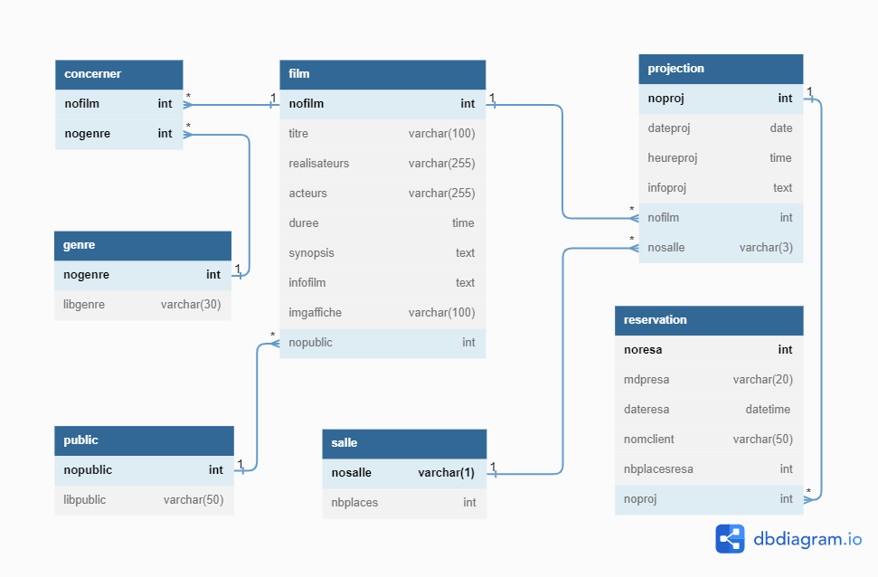
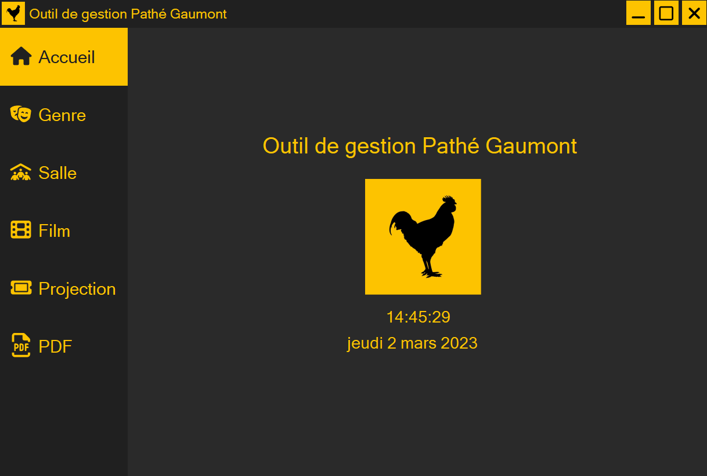
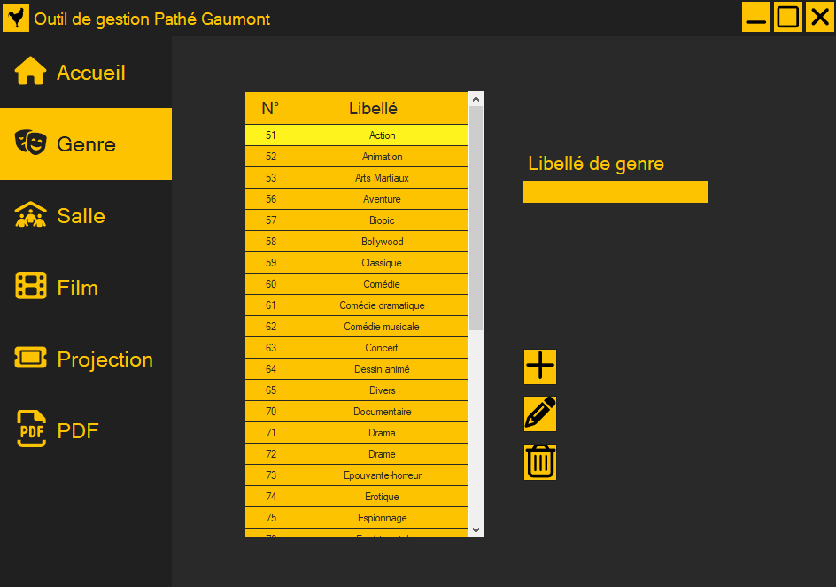
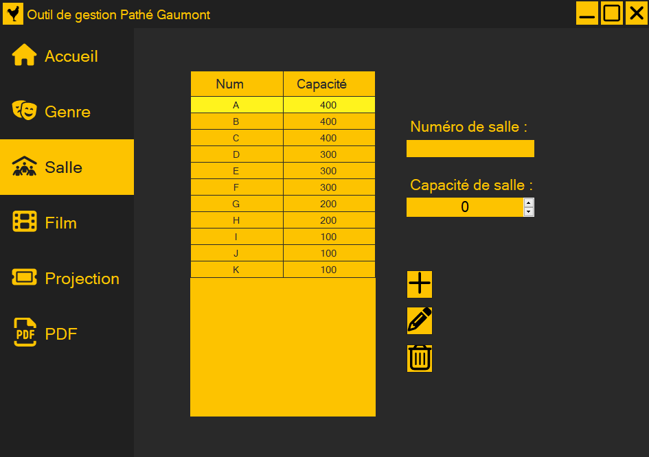
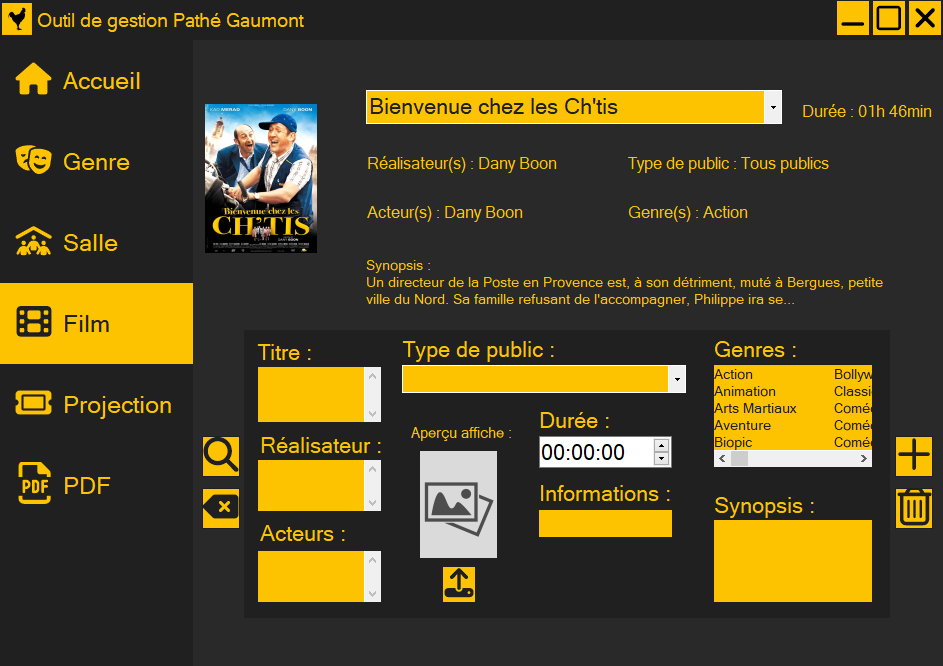
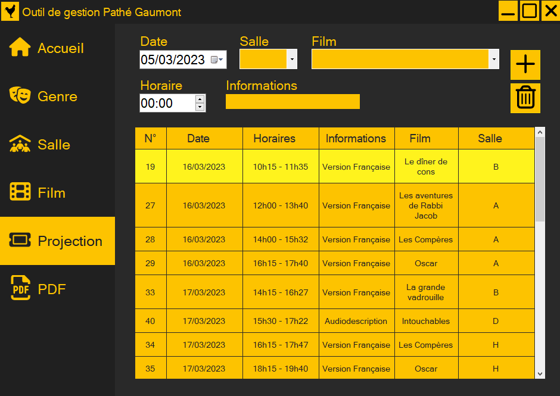
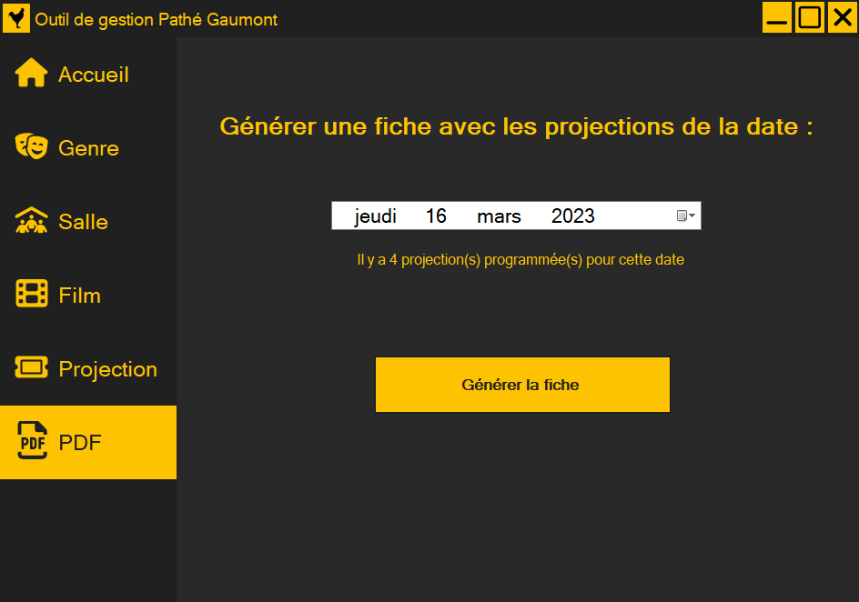

# Application de gestion pour la base de données d'un cinéma.
Ceci est un projet scolaire en BTS SIO première année.
Celui-ci consiste en une application qui permet de manipuler une base de données sur le thème du cinéma.
La base de données contient des informations sur :
- Des genres
- Des salles
- Des films
- Projections

Le but est de pouvoir récupérer, ajouter, modifier et supprimer des données dans celle-ci.

### Schéma de la base de données :

### Images du projet :

- Preview du formulaire d'accueil :

- Preview du formulaire de gestion des genres :

- Preview du formulaire de gestion des salles :

- Preview du formulaire de gestion des films :

- Preview du formulaire de gestion des projections :

- Preview du formulaire pour générer un PDF :

